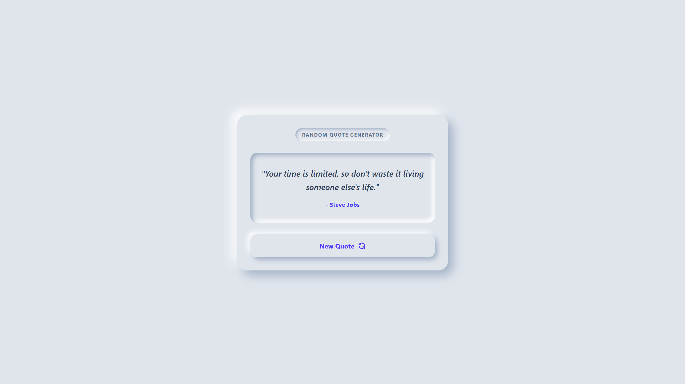

# 🎰 Random Quote Generator

**Created:** August 11, 2026  
**Last Updated:** August 12, 2026

🔗 **Live Demo:** [Click Here 👆]()

An aesthetic, real-time quote generator crafted with **HTML**, **Tailwind CSS**, and **Vanilla JavaScript**. Designed around modern **Neumorphic UI** principles, the interface provides a satisfying, touchable experience with soft relief depth, custom interactive button press states, anti-repetition quote logic, and fluid fade transitions.

---

---

## Features

- 🎯 **Random Quote Generation:** Instantly fetches and displays unique motivational quotes with every click.
- 🔄 **Anti-Repetition Logic:** Smart selection mechanism to ensure the same quote doesn't repeat consecutively.
- 🎨 **Neumorphic UI Design:** Tactile 3D appearance built with custom Tailwind CSS dual drop-shadows and soft inner highlights (`inset`).
- 📱 **Fully Responsive Layout:** Seamlessly scales and adapts from small mobile screens up to large desktop monitors.
- ⚡ **Lightweight & Fast:** Built with pure vanilla JavaScript—no heavy frameworks or external dependencies required.

---

## Tech Stack

| Technology           | Purpose                         |
| -------------------- | ------------------------------- |
| HTML5                | Page structure                  |
| Tailwind CSS         | Styling and layout              |
| JavaScript (Vanilla) | Counter logic and interactivity |
